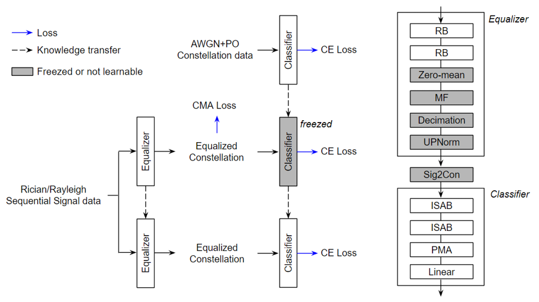

<h2 align="center">EMC²-Net: Joint Equalization and Modulation Classification based on Constellation Network</h2>

<p align="center">

</p>

### Paper
Official source code for ["EMC²-Net: Joint Equalization and Modulation Classification based on Constellation Network"](https://arxiv.org/abs/2303.10934), ICASSP 2023 [[1]](#ref).

We propose a novel MC technique dubbed as EMC²-Net. The main contributions of our work are:
1. Understand constellation as a set of 2D points rather than an image.
2. Train equalizer and classifier jointly under the supervision of modulation type. Two NNs perform separate and explainable roles.
3. Show SOTA performance on the linear modulation classification with much less complexity.

## Prerequisites
- Linux or macOS
- Python 3
- CPU or NVIDIA GPU + CUDA CuDNN

## Requirements
```bash
python==3.7.4
torch==1.10.2+cu113
numpy==1.17.2
scipy==1.3.1
```

### Getting started

- Clone this repo:
```bash
git clone https://github.com/Hyun-Ryu/emc2net emc2net
cd emc2net
```

## How to build synthetic dataset
- All of the data-generating codes are written in MATLAB, saved in `data_generation` folder.
- For AWGN+PO dataset, run `dataset_generation_AWGNPO.m`.
- For Rican or Rayleigh dataset, run `dataset_generation_fading.m`.

## Train
### Phase 1: *Classifier pretraining*
```bash
python train_phase1_noise_cirriculum.py \
    --root "YOUR OWN ROOT DIRECTORY" \
    --data_name "NAME OF DATASET" \
    --exp_name "NAME OF EXPERIMENT"
```

### Phase 2: *Equalizer training*
```bash
python train_phase2.py \
    --root "YOUR OWN ROOT DIRECTORY" \
    --data_name "NAME OF DATASET" \
    --exp_name "NAME OF EXPERIMENT" \
    --pretrain_exp_name "NAME OF PHASE 1 EXPERIMENT"
```

### Phase 3: *Equalizer-classifier fine-tuning*
```bash
python train_phase3.py \
    --root "YOUR OWN ROOT DIRECTORY" \
    --data_name "NAME OF DATASET" \
    --exp_name "NAME OF EXPERIMENT" \
    --pretrain_exp_name "NAME OF PHASE 1 EXPERIMENT" \
    --phase2_exp_name "NAME OF PHASE 2 EXPERIMENT"
```

## Test
### Fading datasets: Rician, Rayleigh
```bash
python test_fading.py \
    --root "YOUR OWN ROOT DIRECTORY" \
    --data_name "NAME OF DATASET" \
    --exp_name "NAME OF EXPERIMENT"
```

### Pretraining dataset: AWGN+PO
```bash
python test_awgnpo.py \
    --root "YOUR OWN ROOT DIRECTORY" \
    --data_name "NAME OF DATASET" \
    --exp_name "NAME OF EXPERIMENT"
```

## Citation
<a name="ref"></a>
```bash
@inproceedings{ryu2023emc,
  title={EMC 2-Net: Joint Equalization and Modulation Classification Based on Constellation Network},
  author={Ryu, Hyun and Choi, Junil},
  booktitle={ICASSP 2023-2023 IEEE International Conference on Acoustics, Speech and Signal Processing (ICASSP)},
  pages={1--5},
  year={2023},
  organization={IEEE}
}
```